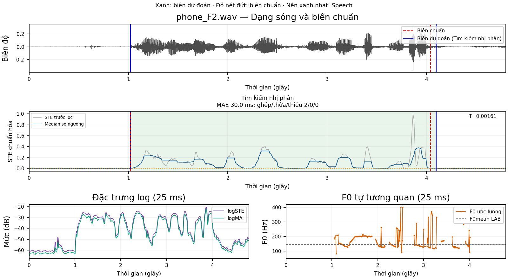
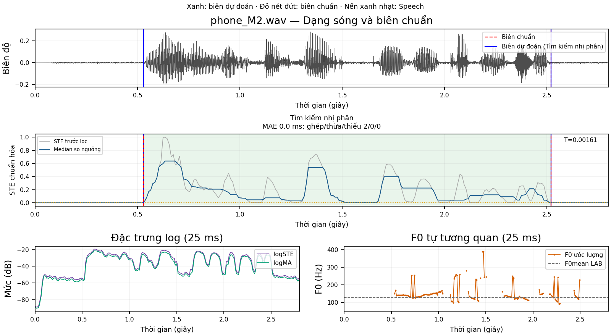
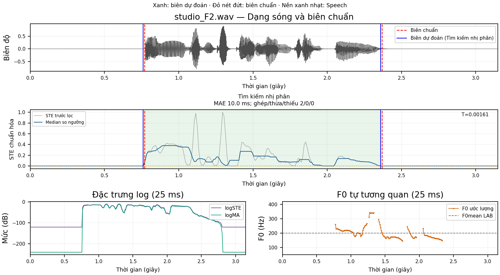
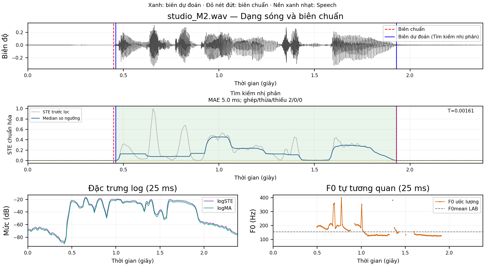

# BÁO CÁO THUẬT TOÁN BINARY SEARCH THEO MÔ TẢ BT1

Đề tài nhóm 03: **Phân đoạn tín hiệu thành tiếng nói và khoảng lặng**.
Sinh viên phụ trách: **Võ Thanh Quân**.

Báo cáo mô tả mã và kết quả hiện hành sau khi chuyển sang cách xử lý BT1 được chốt
từ báo cáo so sánh. Khung danh định 25 ms, bước dịch 10 ms, Silence tối thiểu 200 ms.
Không có mã BT1 gốc; đây là triển khai theo mô tả và kiểm chứng kết quả trên bộ đề,
không phải bản sao mã nguồn hay nguyên xi thuật toán Hodgkinson trong sách.

## 1. Ý tưởng và luồng xử lý

Binary Search tìm một ngưỡng năng lượng T phân biệt Speech/Silence; không trực tiếp
tìm vị trí biên thời gian. Sau phân lớp từng ô 10 ms, chương trình lấy các cạnh ô
nơi nhãn thay đổi làm biên và gộp Silence quá ngắn.

~~~mermaid
flowchart TD
    A[4 WAV TRAIN] --> B[Cửa sổ 25 ms quanh tâm ô 10 ms]
    B --> C[STE và chuẩn hóa riêng từng WAV]
    C --> D[Median sau chuẩn hóa]
    L[LAB TRAIN] --> E[Chia hai lớp theo nhãn tại tâm ô]
    D --> E
    E --> F[Giữ các mẫu thuộc overlap]
    F --> G[Chia đôi để cân bằng diện tích nhầm]
    G --> H[Chấm biên trên TRAIN để chọn median]
    H --> I[Khóa median và T]
    J[4 WAV TEST] --> K[Cùng đặc trưng và median]
    I --> M[So ngưỡng và gộp Silence dưới 200 ms]
    K --> M
    M --> N[Vẽ biên và tính MAE/RMSE]
    R[LAB TEST] --> N
~~~

TRAIN dùng học T và chọn bậc median. Điểm hiệu chỉnh trên TRAIN không phải hiệu suất
độc lập. TEST chỉ dùng đánh giá sau khi mô hình đã khóa; LAB TEST không đi vào suy luận.

## 2. Dữ liệu và nhãn LAB

| Tập | Tên WAV | Vai trò |
|---|---|---|
| TRAIN | phone_F1, phone_M1, studio_F1, studio_M1 | Học ngưỡng và hiệu chỉnh median |
| TEST | phone_F2, phone_M2, studio_F2, studio_M2 | Kiểm tra kết quả cuối |

WAV phone có fs=16.000 Hz; studio có fs=44.100 Hz. WAV và LAB ghép theo cùng tên.
Dòng LAB có dạng: thời điểm bắt đầu, thời điểm kết thúc, nhãn.

- sil → Silence, nhãn nhị phân 0.
- v → âm hữu thanh, Speech, nhãn 1.
- uv → âm vô thanh, Speech, nhãn 1.
- F0mean/F0std là thống kê tham chiếu, không phải nhãn phân đoạn và không học T từ đó.

Nhãn thuộc từng khoảng lấy tại tâm ô quyết định. Không lấy khung chưa có LAB.
Gộp Speech bằng cách đưa cả khung v và uv vào một mảng; không nối các đoạn WAV.

## 3. Vì sao chia khung và cách đặt cửa sổ

Năng lượng từng mẫu dao động mạnh theo dạng sóng. Một cửa sổ ngắn giúp đo mức hoạt
động quanh một thời điểm, trong khi ô quyết định 10 ms tạo lưới thời gian cho biên.
Khung 25 ms chồng lấn vì bước dịch nhỏ hơn độ dài cửa sổ.

Ký hiệu:

| Ký hiệu | Ý nghĩa | Biến trong code |
|---|---|---|
| x[n] | Mẫu âm thanh thứ n, sau đọc PCM | samples |
| fs | Tần số lấy mẫu, Hz | fs |
| N | Tổng số mẫu WAV | len(samples) |
| H | Bước dịch theo mẫu | hop_len |
| L | Độ dài cửa sổ danh định theo mẫu | frame_len |
| t_k | Tâm ô quyết định thứ k, giây | times[k] |
| a_k | Vị trí đầu cửa sổ danh định | left |
| n_k | Số mẫu thực của cửa sổ bị cắt ở mép | len(frame) |

Công thức:

$$H=\operatorname{round}(0.010f_s),\qquad L=\operatorname{round}(0.025f_s).$$

Cạnh ô là các mốc kH/fs và thời điểm cuối WAV; tâm là trung điểm hai cạnh liên tiếp.
Với tâm t_k:

$$a_k=\operatorname{round}((t_k-0.0125)f_s).$$

Cửa sổ lấy mẫu trong khoảng:

$$[\max(0,a_k),\ \min(N,a_k+L)).$$

Không đệm zero vào STE. Ở mép WAV, mẫu số của mean là số mẫu thực có.
Cửa sổ đầu có tâm 5 ms và miền danh định [-7,5;17,5] ms; chỉ phần [0;17,5] ms
nằm trong WAV được sử dụng. Ô cuối có thể ngắn hơn 10 ms.

L=400 và H=160 tại 16 kHz; L=1102 và H=441 tại 44,1 kHz. 25 ms tại 44,1 kHz
được quy đổi thành khoảng 24,989 ms vì số mẫu phải nguyên.

## 4. STE và chuẩn hóa

STE là mean-square của mẫu thực trong cửa sổ:

$$E_k=\frac{1}{n_k}\sum_{n\in\mathcal W_k}x[n]^2.$$

Ở code: ste[k] = mean(frame * frame).
MA = mean(abs(frame)) và các đường log chỉ dùng minh họa.

Chuẩn hóa riêng từng WAV:

$$z_k=\begin{cases}E_k/\max_j E_j,&\max_j E_j>0,\\0,&\text{WAV toàn zero}.\end{cases}$$

Ở code: normalized_ste = ste / max_ste.
Mức này nằm trong [0,1]; không chia theo cực đại của tất cả WAV gộp lại.

## 5. Median sau chuẩn hóa

Với bậc lẻ m=2r+1, đường dùng phân đoạn là:

$$d_k=\operatorname{median}(z_{k-r},\ldots,z_{k+r}).$$

Chỉ số ngoài chuỗi lấy lại phần tử mép gần nhất. Bậc m=1 giữ nguyên chuỗi.
median_filter nhận normalized STE và order; trả decision_ste, không chuẩn hóa lại.

Ví dụ [0,2;0,2;1;0,2;0,2] với m=3 trở thành [0,2;0,2;0,2;0,2;0,2].
Đỉnh một khung bị loại, nhưng giá trị 0,2 không được scale lại thành 1.

Khảo sát m thuộc [1,5,9,11,15,21] chỉ trên TRAIN. Bậc 15 có cửa sổ theo ô khoảng
150 ms; cửa sổ phân tích âm thanh để tính mỗi STE vẫn là 25 ms.

## 6. Gán nhãn và gộp hai lớp

Ví dụ từ phone_F1:

| Ô k | Tâm (s) | Khoảng mẫu danh định | STE | z_k | d_k, median 15 | LAB |
|---|---:|---|---:|---:|---:|---|
| 52 | 0,525 | [8200;8600) | 0,00006998668 | 0,0005313399 | 0,0005754931 | sil |
| 53 | 0,535 | [8360;8760) | 0,00011348552 | 0,0008615837 | 0,0008615837 | v |

LAB v bắt đầu tại 0,53 s. Ô 52 vẫn được gán Silence vì tâm 0,525 s đứng trước
mốc đó, dù cửa sổ chứa vài mẫu Speech. Ô 53 gán Speech vì tâm 0,535 s thuộc v.

Sau median mỗi WAV, training_arrays(records, median_order=15) tách:
silence_values thêm d_k có LAB sil; speech_values thêm d_k có LAB v/uv.
Tổng trên bốn TRAIN: **503 khung Silence, 794 khung Speech**.

Bậc median chỉ thay giá trị năng lượng; không sửa nhãn LAB. Hai lớp vẫn có thể
chồng lấn vì Speech yếu và nền có nhiễu.

## 7. Giữ mẫu overlap trước khi tính mean

Đặt:

$$T_{\min}=\min(\mathrm{Speech}),\quad T_{\max}=\max(\mathrm{Silence}).$$

Nếu T_max < T_min, hai lớp tách rời: chọn trung điểm giữa hai mép.
Nếu bằng nhau, trả đúng điểm chạm. Không lấy trung điểm hai mean lớp ở trường hợp này.

Nếu có overlap:

$$S_o=\{s\in\mathrm{Silence}:T_{\min}\le s\le T_{\max}\},$$
$$P_o=\{p\in\mathrm{Speech}:T_{\min}\le p\le T_{\max}\}.$$

Trên TRAIN hiện tại sau median 15:

- T_min=0,0006727783000629138.
- T_max=0,010713443135913563.
- S_o có 118 mẫu; P_o có 108 mẫu.

Các quan sát ngoài overlap không còn trong mẫu số mean. Đây là thay đổi quan
trọng so với bản cũ chia cho số khung toàn lớp.

Ví dụ Silence=[0;0,1;0,2], Speech=[0,15;0,3;0,4;0,9]:
S_o=[0,2], P_o=[0,15]. Hai diện tích bằng nhau tại T=0,175.
Dùng số mẫu toàn lớp sẽ giải phương trình khác và cho khoảng 0,17857143.

## 8. Chia đôi để tìm T

Độ nhầm hai phía:

$$A_\mathrm{Sil}(T)=\frac{1}{|S_o|}\sum_{s\in S_o}\max(s-T,0),$$
$$A_\mathrm{Sp}(T)=\frac{1}{|P_o|}\sum_{p\in P_o}\max(T-p,0),$$
$$\Delta(T)=A_\mathrm{Sil}(T)-A_\mathrm{Sp}(T).$$

| Đại lượng | Ý nghĩa | Code |
|---|---|---|
| T | Ngưỡng STE đang thử | mid |
| S_o, P_o | Hai mảng overlap | overlap_silence, overlap_speech |
| A_Sil | Mean phần năng lượng Silence vượt T | maximum(overlap_silence - mid, 0).mean() |
| A_Sp | Mean phần thiếu năng lượng Speech so với T | maximum(mid - overlap_speech, 0).mean() |
| Delta | Hiệu hai diện tích nhầm | delta |
| Cận dưới/trên hiện tại | Khoảng chứa ngưỡng cần tìm | lo, hi |

Mỗi vòng lấy mid=(lo+hi)/2:

1. Delta>0: Silence vượt T còn lớn hơn; tăng ngưỡng bằng lo=mid.
2. Delta<0: phần Speech dưới T còn lớn hơn; giảm ngưỡng bằng hi=mid.
3. Dừng nếu abs(Delta)<=1e-10 **hoặc** hi-lo<=1e-10; tối đa 200 vòng.

Các vòng đầu trên TRAIN đã median:

| Vòng | T | Delta | Thay cận |
|---|---:|---:|---|
| 1 | 0,005693110718 | -0,002097922130 | hi=T |
| 2 | 0,003182944509 | -0,000645717362 | hi=T |
| 3 | 0,001927861405 | -0,000122725624 | hi=T |
| 4 | 0,001300319852 | +0,000091894520 | lo=T |

Hiện dừng ở vòng **24**, T=**0,0016054241805765488**,
Delta≈-7,18e-11 và độ rộng khoảng≈1,197e-9. Dừng vì residual đủ nhỏ; không phải
độ rộng khoảng đã dưới 1e-10. Điều kiện dừng này khác dừng theo số đếm trong sách.

Giá trị T trong báo cáo BT1 khoảng 0,0016054239935545923; chênh khoảng 1,9e-10
nằm trong độ chính xác đối chiếu và không làm khác biên trên bốn TEST.

## 9. Chọn median bằng TRAIN và khóa mô hình

Với mỗi bậc m:

1. Tính d_k, gán nhãn và gộp cả bốn TRAIN.
2. Học T bằng overlap-only Binary.
3. Phân đoạn lại bốn TRAIN, gộp Silence <200 ms và ghép biên với LAB TRAIN.
4. Chấm bộ khóa: tổng biên thừa/thiếu, MAE trung bình, m nhỏ hơn khi hòa.

Chỉ chọn trong [1,5,9,11,15,21], không thử frame/hop.
Hiện chọn **m=15**, tổng biên lỗi TRAIN=0, MAE TRAIN trung bình≈15 ms.
Đây là hiệu chỉnh trên tập đã dùng học, **không phải Cross Validation/LOO**.

JSON mô hình có frame_ms=25, hop_ms=10, median_order=15, T,
feature_layout=centered_hop_v1 và training_protocol=train_calibration.
Mô hình cũ dù có 25/10 ms vẫn bị từ chối vì cửa sổ phân tích đã thay đổi.

## 10. Phân đoạn TEST và hậu xử lý

TEST được tính STE/chuẩn hóa/median theo đúng mô hình đã khóa:

$$\widehat y_k=\begin{cases}1,&d_k\ge T,\\0,&d_k<T.\end{cases}$$

Tại mỗi chuỗi ô Silence liên tục, đo thời lượng bằng hai cạnh ngoài.
Chuyển thành Speech nếu thời lượng <200 ms; 200 ms và dài hơn được giữ.
Quy tắc áp dụng cả Silence ở đầu/cuối WAV, không loại Speech ngắn.
Zero-audio được giữ Silence riêng trước hậu xử lý, tránh biến đoạn zero ngắn thành Speech.

Biên là cạnh ô khi mask đổi True/False. Hai đầu WAV không phải biên nội bộ.
Không cộng/trừ mốc cố định để làm kết quả khớp LAB.

## 11. MAE, RMSE và biên thừa/thiếu

Ghép các cặp cùng hướng, gần nhất trước, mỗi biên dùng một lần; không cutoff
100/200 ms. Khi hòa, ưu tiên biên chuẩn rồi dự đoán xuất hiện sớm hơn.

Với M cặp được ghép:

$$e_i=1000(\widehat b_i-b_i),$$
$$\mathrm{MAE}=\frac1M\sum_i|e_i|,\qquad
\mathrm{RMSE}=\sqrt{\frac1M\sum_i e_i^2}.$$

b_i là biên LAB theo giây; b_hat_i là biên dự đoán; e_i theo ms.
Biên thừa/thiếu không đi vào mean này và luôn phải đọc riêng. Không ghép được
thì MAE/RMSE là None, không phải zero.

Mean-file là trung bình các metric từng WAV. Pooled gộp lỗi của tất cả cặp trước
khi tính mean/căn. Mỗi TEST hiện có hai cặp nên MAE hai cách bằng nhau; RMSE khác.

## 12. Kết quả Binary Search hiện hành

| WAV | START chuẩn / dự đoán (s) | END chuẩn / dự đoán (s) | MAE (ms) | RMSE (ms) | Thừa/thiếu |
|---|---|---|---:|---:|---|
| phone_F2 | 1,02 / 1,02 | 4,04 / 4,10 | 30 | 42,426 | 0/0 |
| phone_M2 | 0,53 / 0,53 | 2,52 / 2,52 | 0 | 0 | 0/0 |
| studio_F2 | 0,74 / 0,76 | 2,36 / 2,36 | 10 | 14,142 | 0/0 |
| studio_M2 | 0,45 / 0,46 | 1,93 / 1,93 | 5 | 7,071 | 0/0 |

- Mean-file MAE=**11,25 ms**, RMSE=**14,874 ms**.
- Pooled MAE=**11,25 ms**, RMSE=**22,079 ms**.
- Tổng tám cặp ghép, không biên thừa/thiếu.
- Ba biên thừa của bản cũ trên phone_F2 đã hết sau thay đổi luồng xử lý.
- END phone_F2 vẫn trễ 60 ms: phù hợp với đường median/STE duy trì trên T ở đuôi.
  Chưa có thí nghiệm tách riêng để quy toàn bộ 60 ms cho một bước duy nhất.

Hình có waveform, STE trước/sau median, biên xanh/đỏ, logSTE/logMA và F0.
F0mean LAB là một số tham chiếu; không phải đường F0 chuẩn theo thời gian.
F0 không thay đổi quyết định Speech/Silence.

## 13. Khảo sát nhiễu và giới hạn

Mỗi thuật toán có 48 ca: bốn TEST × Q=30/20/10/0 dB × ba seed 2026/2027/2028.
Q là tỷ số công suất toàn WAV và nhiễu trắng thêm, không phải SNR sạch cuối đã biết.
Không dùng kết quả thêm nhiễu để chọn lại median/T/W.

SNR nền ước lượng từ LAB lấy P_signal≈P_speech_observed-P_silence.
Khi công suất nhiễu bằng zero hoặc P_signal<=0, trả None; không ép thành 0 dB.

Không có biên thừa/thiếu trên bốn file gốc không chứng minh thuật toán luôn đúng
với mọi mức nhiễu hay cuộc hội thoại. Bảng TEST không đại diện cho dữ liệu khác.
Median có thể làm mất đoạn hoạt động rất ngắn; overlap-only và Gaussian dựa trên
giả định phân bố của đặc trưng. Các hình cần đọc cùng số liệu và bình luận vị trí.

## 14. Mã nguồn và các file minh chứng

| Phần | Chức năng |
|---|---|
| main.py của thành viên | Chạy riêng Binary trên bốn TEST |
| algorithm.py: binary_threshold | Overlap-only, chia đôi và xử lý vùng chạm |
| ../speech_silence/features.py | Cửa sổ căn giữa, STE/MA, median, F0, hậu xử lý |
| ../speech_silence/pipeline.py | Hiệu chỉnh median trên TRAIN, khóa mô hình, suy luận |
| ../speech_silence/evaluation.py | Greedy, MAE/RMSE, hai kiểu tổng hợp, SNR |

Chạy từ gốc: python3 TT1_BinarySearch/main.py --no-show --noise.
Notebook VoThanhQuan_BinarySearch.ipynb tự chứa mã và đã lưu output sau chạy.

- [Mô hình và calibration TRAIN](ket_qua/tham_so_huan_luyen.json).
- [Metric từng TEST](ket_qua/ket_qua.csv).
- [Mean-file và pooled](ket_qua/tong_hop.csv).
- [Biên dự đoán](ket_qua/bien_du_doan.csv).
- [Bình luận từng hình](ket_qua/binh_luan_tung_hinh.md).
- [Khảo sát nhiễu Binary](ket_qua/khao_sat_nhieu.csv).
